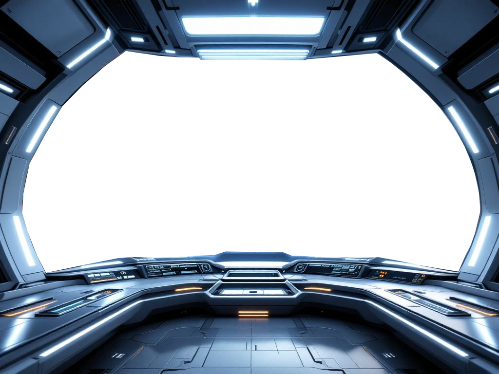

# Spacewar 3D 🚀 (v0.69)

> Ein rundenbasiertes 3D-Strategiespiel im Weltraum – inspiriert von Klassikern wie *Risiko*.



## Über das Spiel

Erobere alle Planeten der Galaxie! Tritt gegen bis zu fünf KI-Gegner an. Das Spiel bietet anpassbare Regeln, zufällige Weltraum-Ereignisse und flexible Einstellungen für Schwierigkeitsgrad, Spielfeldgröße und Medien.

## Features
- 🌌 **3D-Weltraum-Karte** mit Three.js – dreh- und zoombar
- 🤖 **KI-Gegner** mit mehreren Schwierigkeitsstufen  
- 🎲 **Zufallsereignisse:** Sonnenstürme, Meteoriten, Supernovae, Kometen, Sonden
- 🔊 **Soundeffekte & Musik** für volle Immersion
- 📱 **Desktop & Mobile** – Maus- und Touch-Steuerung
- ⚙️ **Anpassbare Regeln** für erfahrene Spieler

## Schnellstart

1. **Repo klonen** oder [im Browser spielen](https://github.com/FrankRSK/Spacewar3D) (`index.html` öffnen)
2. Keine Installation nötig – alles läuft im Browser
3. Spiel starten und loslegen!

```bash
git clone https://github.com/FrankRSK/Spacewar3D.git
cd Spacewar3D
# Einfach index.html im Browser öffnen!
```

## Technik

| Komponente | Technologie |
|-----------|-------------|
| 3D-Engine | Three.js r128 + OrbitControls |
| UI | Tailwind CSS |
| Sound | Web Audio API |
| Build | Keiner – reines HTML/CSS/JS |
| Abhängigkeiten | Alle via CDN geladen |

## Lizenz

MIT © 2026 Frank Kemper
